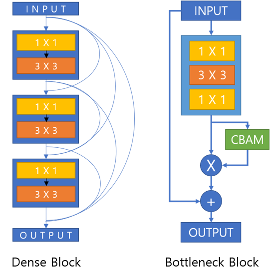

# HandPoseWithDenseNet

This repository implemented for experiment of skip-connection's power.

I experimented using Dense-U-Net which consist of dense block and bottleneck block.

## HandPoseWithDenseNet

### Model

Dense block and bottleneck block are like under picture.  

Dense blocks were used in U-Net main block. and bottleneck blocks were used in skip-connection.

So main model's appearance is U-Net. and I tried 4 types networks.

Base model used only base skip-connection looks like a u-net. others used additional up or down 

When I merged the skip connection and up stream, I used concatenation and additional conv  block. 

---

### Experiment

#### Dataset
I used [mph_dataset](http://www.rovit.ua.es/dataset/mhpdataset/).

It provided 2D, 3D points and bounding box about hands. and I used 2D, 3D points.

And I used 45,581 for training, 13,023 for validation and 6,511 for test.

For 2D estimation, I used heatmap format. and 3D Estimation used relative points which origin to palm. 

and used Focal Loss for 2D points and MSE Loss for 3D Points estimation.

### Result

I measured performance of networks using PCK(PCK 2D, PCK 3D).  
PCK 2D measure amount of pixel between predicted and ground-truth.
PCK 3D measure percentage of distance between prediction and ground-truth about base distance like j1-parm distance. 
and under pictures saw the result of model training. validation loss in training step. and PCK 2D, PCK 3D in test dataset.

---

---

What I expected was using all skip-connection will have best performance.  
 
but actually result showed the using additional under skip-connection has best performance.

----
### What I will do.
- Inference code implement.
- training code using argment
